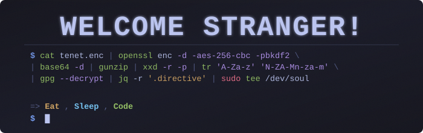

<div align="center">





[](https://github.com/winzerprince)
[](https://github.com/winzerprince?tab=followers)
[](https://github.com/winzerprince?tab=repositories)

</div>

---

## Who am I?
Hi, I'm Winzer Prince, I started programming cause I like bringing ideas to life.

```typescript
winzer = {
  name: "Winzer Prince",
  role: "Software Engineer",
  location: "Earth",
  passions: [ "Maths", "Linux", "Music"],
  currentFocus: ["Systems programming","Backend", "DevOps", "Systems Design"],
  favourite_quote: "There's never been a moment in your life that is not now, now is all you'll ever have - Eckhart Tolle",
  currentlyLearning: {
    topics: ["Assembly", "Embedded Systems", "Python", "ML", "Go", "C/C++"],
    frameworks: ["ESP-IDF","Next.js", "FastAPI", "Laravel"],
    devops: [
      "Docker", 
      "Kubernetes", 
      "Terraform", 
      "Ansible", 
      "Prometheus", 
      "GCP", 
      "AWS", 
      "Linux engineering"
    ]
  }
};

```

<div align="center">

###  *"Exploring the depths of Systems one abstraction at a time"*

</div>

---

## Skills and Stuff I'm Into
<div align="center">

### Backend & Database


### DevOps & Tools


### Frameworks & Runtimes


### Mobile & Cross-Platform


### Stuff I'm focusing on now


### Linux Distros I've used (If you care to know 🙃)


### Favorite Tools & Software
[](https://neovim.io)
[](https://www.gns3.com/)


</div>

---

## Analytics

<div align="center">


</div>

<div align="center">

[](https://git.io/streak-stats)

</div>

---


### Stuff I'm doing right now

- **Systems Programming and Embedded Systems** - Building code that interfaces between hardware and software
- **Devography** - A documentation of my learning journey and insights from books, experiences and projects.
- **Python** - Data manipulation and machine learning
- **Bash Scripting** - Linux automation and system administration
- **System Design** - Scalable architecture principles

---


---

## Activity Graph

<div align="center">

[](https://github.com/winzerprince)

</div>

---

## Achievements

<div align="center">

[](https://github.com/ryo-ma/github-profile-trophy)

</div>

---

## Featured Projects

<div align="center">

[](https://github.com/winzerprince/sentio)
[](https://github.com/winzerprince/taskaban)
*Loading more projects ...*

</div>

---

## Let's Connect

<div align="center">

[](https://github.com/winzerprince)
[](https://linkedin.com/in/winzerprince)
[](mailto:aitajprince200@gmail.com)

### *I'm always open to opportunities to collaborate, learn and teach!*

</div>

---

<div align="center">

### Good Day 👋!


</div>
